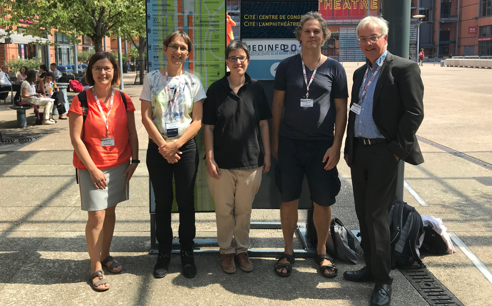

## Project Leaders

<a href="{{ site.links.winter}}">Alfred Winter</a> 
Leipzig, Germany 
permanent professor 

<a href="{{ site.links.paech}}">Barbara Paech</a> 
Heidelberg, Germany 
permanent professor 

<!--  -->
## Project Team

<a href="{{ site.links.hoeffner}}">Konrad Höffner</a> 
Leipzig, Germany 
Webmaster, Ontologist, Programmer 

<a href="{{ site.links.jahn }}">Franziska Jahn</a> 
Leipzig, Germany 
Project Coordinator 

<a href="{{ site.links.schneider }}">Birgit Schneider</a> 
Leipzig, Germany 
Ontologist 

<!---->

<a href="{{ site.links.kuecherer }}">Christian Kücherer</a> 
Leipzig, Germany 
Webmaster, Programmer 

<a href="{{ site.links.pause }}">Thomas Pause</a> 
Leipzig, Germany 
Webmaster, Programmer 

<!-- MS, ST, CK-->

## Webmaster

Konrad Höffner 
Please report website issues at the <a href="https://github.com/snikproject/snik.eu/issues" target="_blank">GitHub Issue Tracker</a>.

## Address

Institut für Medizinische Informatik, Statistik und Epidemiologie 
Leipzig University 
Härtelstraße 16-18 
04107 LEIPZIG 
GERMANY
