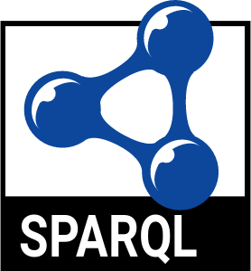
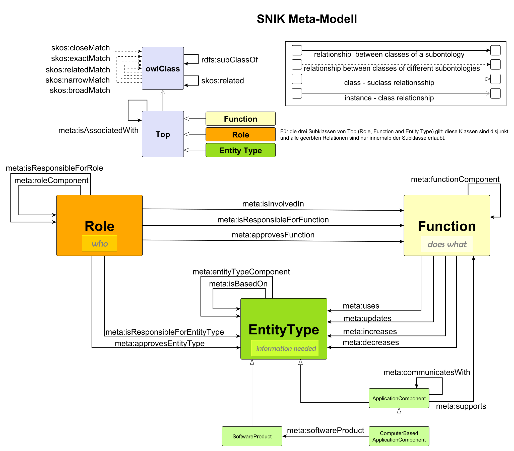
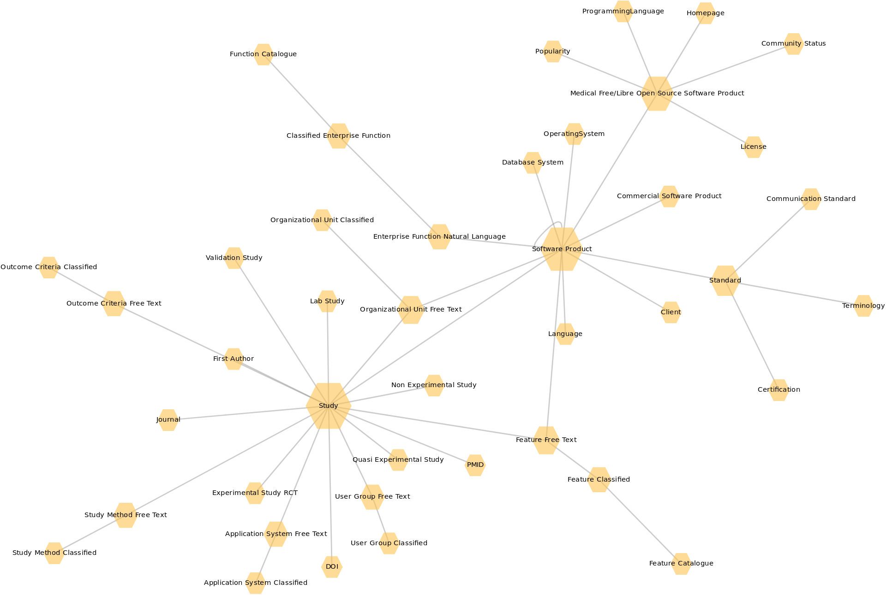

<!--
{{ site.description }}
-->

## Projektinformationen

Ziel des DFG-geförderten Projektes ist ein semantisches Netz des integrierten Informationsmanagements im Krankenhaus (SNIK), welches Begriffe des Informationsmanagements und deren Beziehungen untereinander beschreibt.
Auf Basis des SNIK entsteht das Werkzeug „CIO-Navigator“ (CION) und ein Blended-Learning-Modul für die Ausbildung in der Medizinischen Informatik.

Projektlaufzeit: 2014–2017

Projektförderkennzeichen: 1605/7-1 und 1387/8-1

Eine Auswahl unserer Visualisierungen, Schnittstellen und Werkzeuge:

  <a title="Browse" href="https://www.snik.eu/ontology/">RDF-Browser
  
</a>

  <a title="Query" href= "https://www.snik.eu/sparql/">SPARQL Endpunkt
  
</a>

  <a title="Browse" href="https://www.snik.eu/graph/">Graphvisualisierung
  
</a>

<a title="Download" href="https://github.com/snikproject/ontology/archive/refs/heads/master.zip">RDF Dump 

</a>

 

---
## Metamodell

---

  
  The SNIK Meta Model

---
<!--
The HITO-Graph
-->
