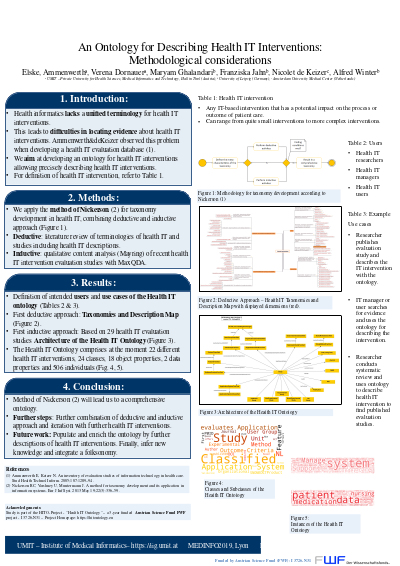

<!-- use css for superduper collapsibles -->
<link rel="stylesheet" href="public/css/collapse.css">
## Papers

<iframe width="560" height="630" src="public/paper_vdornauer.pdf" frameborder="0" allowfullscreen></iframe>

* Dornauer V, Jahn F, Hoeffner K, Winter A, Ammenwerth E.  **Use of Natural Language Processing for Precise Retrieval of Key Elements of Health IT Evaluation Studies.**

<a href="http://ebooks.iospress.nl/publication/54602">Link</a>

  <input id="collapsible0" class="toggle" type="checkbox">
  <label for="collapsible0" class="lbl-toggle">Open BibTeX</label>
  

    

      

        @article{hito_nlp_paper, 
        author = {Dornauer, Verena and Jahn, Franziska and Höffner, Konrad and Winter, Alfred and Ammenwerth, Elske}, 
        year = {2020}, 
        month = {06}, 
        pages = {95-98}, 
        title = {Use of Natural Language Processing for Precise Retrieval of Key Elements of Health IT Evaluation Studies}, 
        volume = {272}, 
        journal = {Studies in health technology and informatics}, 
        doi = {10.3233/SHTI200502}}
      

    

  

<iframe width="560" height="630" src="public/paper_fjahn.pdf" frameborder="0" allowfullscreen></iframe>

* Jahn F, Bindel M, Hoeffner K, Ghalandari M, Schneider B, Stäubert S, Dornauer V, Karopka T, Ammenwerth E, Winter A.  **Towards Precise Descriptions of Medical Free/Libre and Open Source Software.**

<a href="https://ebooks.iospress.nl/publication/54205">Link</a>

  <input id="collapsible0" class="toggle" type="checkbox">
  <label for="collapsible0" class="lbl-toggle">Open BibTeX</label>
  

    

      

        @article{hito_medfloss_paper, 
        author = {Jahn, Franziska and Bindel, Michelle and Hoeffner, Konrad and Ghalandari, Maryam and Schneider, Birgit and Staeubert, Sebastian and Dornauer, Verena and Karopka, Thomas and Ammenwerth, Elske and Winter, Alfred}, 
        year = {2020}, 
        pages = {463-468}, 
        title = {Towards Precise Descriptions of Medical Free/Libre and Open Source Software}, 
        volume = {270}, 
        journal = {Digital Personalized Health and Medicine}, 
        doi = {10.3233/SHTI200203}}
      

    

  

## Posters
<figure>

<figcaption>
Developing and implementing a health IT ontology for facilitating retrieval of health IT evaluation studies. 
Verena Dornauer, Maryam Ghalandari, Konrad Höffner, Franziska Jahn, Alfred Winter, Elske Ammenwerth.
GMDS 2019, Dortmund.
</figcaption>
</figure>

  <input id="collapsible1" class="toggle" type="checkbox">
  <label for="collapsible1" class="lbl-toggle">Open BibTeX</label>
  

    

      

      @INPROCEEDINGS {hitomethods1, 
          author    = "Verena Dornauer, Maryam Ghalandari, Konrad Höffner, Franziska Jahn, Alfred Winter, Elske Ammenwerth", 
          title     = "Developing and implementing a health {IT} ontology for facilitating retrieval of health {IT} evaluation studies", 
          booktitle = "64. Jahrestagung der Deutschen Gesellschaft für Medizinische Informatik, Biometrie und Epidemiologie e. V. (GMDS)", 
          year      = "2019"}
      

    

  

<figure>

<figcaption>
Challenges and solutions while developing HITO&ndash;a Health IT Ontology. 
Verena Dornauer, Maryam Ghalandari, Konrad Höffner, Franziska Jahn, Birgit Schneider, Alfred Winter, Elske Ammenwerth.
ICIMTH 2019, Athens. Best Poster Award.
</figcaption>
</figure>

  <input id="collapsible2" class="toggle" type="checkbox">
  <label for="collapsible2" class="lbl-toggle">Open BibTeX</label>
  

    

      

      @INPROCEEDINGS {hitomethods2, 
          author    = "Verena Dornauer, Maryam Ghalandari, Konrad Höffner, Franziska Jahn, Birgit Schneider, Alfred Winter, Elske Ammenwerth", 
          title     = "Challenges and solutions while developing {HITO}–a {H}ealth {IT} {O}ntology", 
          booktitle = "International Conference on Informatics, Management, and Technology in Healthcare", 
          year      = "2019"}
      

    

  

<figure>

<figcaption>
An Ontology for Describing Health IT Interventions: Methodological Considerations. 
Elske Ammenwerth, Verena Dornauer, Maryam Ghalandari, Franziska Jahn, Nicolet de Keizer, Alfred Winter. 
Proceedings of Medinfo 2019, the 17th World Congress on Medical and Health Informatics, 25.-30.8.2019, Lyon. 
Amsterdam: IOS Press. pp. 1419-20.
</figcaption>
</figure>

  <input id="collapsible3" class="toggle" type="checkbox">
  <label for="collapsible3" class="lbl-toggle">Open BibTeX</label>
  

    

      

      @INPROCEEDINGS {hitomethods3, 
        title={An Ontology for Describing Health {IT} Interventions: {M}ethodological Considerations}, 
        author={Ammenwerth, Elske and Dornauer, Verena and Ghalandari, Maryam and Jahn, Franziska and Winter, Alfred}, 
        journal={GMDS}, 
        volume={264}, 
        pages={1419--1420}, 
        year={2019} }
      

    

  

<!-- Script for superduper collapsibles -->

## Workshops/Presentations

<iframe width="560" height="315" src="https://www.youtube.com/embed/ZcF0uyZMjvQ?rel=0;autoplay=1;modestbranding=1" frameborder="0" allow="accelerometer; autoplay; encrypted-media; gyroscope; picture-in-picture" allowfullscreen></iframe>

Use of Natural Language Processing for Precise Retrieval of Key Elements of Health IT Evaluation Studies (Workshop with V.Dornauer)
 

<a href="https://www.youtube.com/watch?v=ZcF0uyZMjvQ">Link</a>

  <input id="collapsible4" class="toggle" type="checkbox">
  <label for="collapsible4" class="lbl-toggle">Open BibTeX</label>
  

    

      

        @article{hito_nlp_workshop, 
        author = {Dornauer, Verena and Jahn, Franziska and Höffner, Konrad and Winter, Alfred and Ammenwerth, Elske}, 
        year = {2020}, 
        month = {06}, 
        pages = {95-98}, 
        title = {Use of Natural Language Processing for Precise Retrieval of Key Elements of Health IT Evaluation Studies}, 
        volume = {272}, 
        journal = {Studies in health technology and informatics}, 
        doi = {10.3233/SHTI200502}}
      

    

  

<iframe width="560" height="315" src="public/presentation_fjahn.pdf" frameborder="0" allowfullscreen></iframe>

An ontology for precise descriptions of medical free/libre open source software (Presentation by Franziska Jahn, Thomas Karopka et al.)
 

<a href="https://www.orthanc-server.com/static.php?page=conference-schedule">Link</a>

<h4>Abstract</h4>
The website medfloss.org provides a platform for retrieving medical FLOSS projects. Currently, it lists 361 projects that are described by certain characteristics like application type, license, and enterprise functions supported. The vocabulary used to describe the FLOSS projects does not describe the functionalities of FLOSS projects sufficiently in many cases. An ontology enabling systematic descriptions of medical software could help developers to clearly specify the software’s functionalities and make FLOSS projects on medfloss.org even better retrievable and comparable.

HITO, the health IT ontology, is developed by an Austrian-German research team in order to support systematic descriptions of medical software. HITO integrates different existing taxonomies (e.g. parts of SNOMED CT, WHO classification of digital interventions) and software characteristics found in literature. To describe FLOSS projects on medfloss.org using HITO, the support of the FLOSS community is needed.
