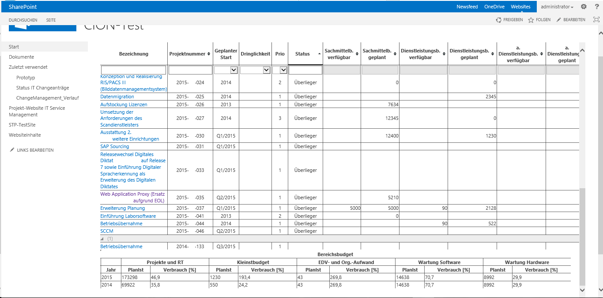

Abbildung 1: Übersicht über die erzielten Projektergebnisse

## Das SNIK Metamodell

Die Strukturierung und Abbildung von Wissens in einer Ontologie, setzt ein Metamodell voraus, welches domänenunabhängige Konzepte zur Beschreibung von Wissen vorgibt.
Im ersten Schritt wurde ein Metamodell (Abbildung 2) entwickelt , auf dessen Grundlage Wissen aus Literatur zum Informationsmanagement im Krankenhaus, strukturiert extrahiert werden kann.

Abbildung 2: Das SNIK-Metamodell

## Die Visualisierung der Ontologie

Derzeit beinhaltet die SNIK Ontologie mehr als 2000 Konzepte, 4500 Relationen und ca. 15000 Annotationen.
Die ursprüngliche Abbildung unserer Ontologie erfolgte mittels eines Spreadsheet im CSV-Format.
Insbesondere im Bereich der Lehre benötigen Studenten ein tiefes Verständnis der Struktur und des Inhalts der Ontologie.
Dies erscheint in Bezug auf kleine Ontologien einfach, wird jedoch mit steigender Größe nahezu unmöglich.
Zur effektiven Nutzung der entwickelten Ontologie, ist also eine geeignete Darstellungsform zwingend erforderlich.
Die Forschung zur Visualisierung von Ontologien, resultierte in einer Liste existierender Werkzeuge.
Unter Berücksichtigung von Kriterien wie Performance, Bedienbarkeit, Wartung, Funktionalität und Aktualität, wurden diese bewertet.
Vielversprechende Werkzeuge sind Gephi, Tulip und Cytoscape.
Aufgrund der Erweiterbarkeit durch Plugins und der Möglichkeit der webbasierten Enwicklung mittels einer JavaScript Bibliothek erfolgte die Visualisierung (Abbildung 3) der SNIK Ontologie mit Cytoscape.
 
<a href="https://www.snik.eu/graph">Visualisierung im Browser ansehen</a>.

Abbildung 3: Die Visualisierung der Ontologie

## CIO Umfrage

Die CIO Umfrage hat zum Ziel die Situation der IT-LeiterInnen des Informationsmanagements im Krankenhaus näher zu beleuchten.
Dazu wurden 1284 IT-Leiterinnen per E-Mail kontaktiert, von denen 164 die Fragebögen beantwortet haben wurde (Rücklaufquote 12,8 %).
Neben den Charakteristika der Krankenhäusern, IT-Abteilungen und den IT-LeiterInnen, wurden die Kommunikation mit der Geschäftsführung, die Aufgaben des Informationsmanagements, und die Anwendungssysteme für Aufgaben des Informationsmanagement im Detail erfasst und ausgewertet.
Siehe auch: <a href="http://subs.emis.de/LNI/Proceedings/Proceedings259/685.pdf">The Status Quo of Information Management in Hospitals – Results of an Online Survey</a>

## Umfragereport

Im Umfragereport <a href="public/umfragereport.pdf">"Charakteristika von IT-Abteilungen in Krankenhäusern in Deutschland"</a> wird der Status quo und der Stellenwert des Informationsmanagements in Krankenhäusern zum Umfragezeitpunkt im Jahr 2016 dargestellt.
Es wurde unter anderem überprüft, inwieweit die in SNIK modellierten Aufgaben des strategischen, taktischen und operativen Informationsmanagements tatsächlich im Informationsmanagement von Krankenhäusern eine Rolle spielen.

## Systemanalyse

Die Systemanalyse wurde mit dem Ziel die Ist-Situation des Informationsmanagements zweiter deutscher Krankenhäuser zu erfassen durchgeführt.
Neben einer detaillierten Beschreibung der bestehenden Aufgaben der Informationsmanagement-Abteilung wurden die dabei verwendeten Informationsobjekte und Anwendungssysteme als 3LGM2 Modelle beschrieben.
Die Systemanalyse zeigt große Unterschiede in der Ausprägung der IM-Aufgaben und eingesetzten Werkzeuge.
Siehe auch: <a href="http://subs.emis.de/LNI/Proceedings/Proceedings246/783.pdf">System Analysis of Information Management</a>

## DsTORE

Zur Spezifikation des persönlichen entscheidungsuntertützenden System CIO-Navigator wurde die Aufgabenorientierte Requirements Engineering Methode TORE erweitert.
DsTORE kombiniert die Vorteile von TORE mit der Spezifikation von Entscheidungsaufgaben.
Die Vorteile von TORE sind die Erfassung und damit einhergehend das Verständnis von NutzerInnen-Aufgaben, die Unterstützung von UI-Prototypen und die explizite Berücksichtigung der Anwendungsdomäne und NutzerInnen-Interaktionen.
DsTORE (vgl. Abbildung 4) erweitert TORE um die Klassifikation von Aufgaben hinsichtlich deren Entscheidungscharakter, die Berücksichtigung von entscheidungsspezifischen Datenstrukturen, die Verknüpfung von Entscheidungen mit den notwendigen Daten, und die explizite Dokumentation unterschiedlicher Datenquellen, deren Ort und Format.

Abbildung 4: Entscheidungspunkte von DsTORE für die Spezifikation entscheidungsunterstützender Systeme

## TOREOnto

Die Qualität von Anforderungen kann mit Hilfe von Domänenwissen verbessert werden.
Domänen-Ontologien enthalten solches Wissen in maschinenlesbarer Form.
Auf Basis einer Literaturstudie wurden 9 verschiedene Nutzungsszenarien identifiziert, wie Ontologien im Requirements Engineering zur Verbesserung der Qualität von Anforderungen verwendet werden können.
TOREOnto ermöglicht die Instanziierung der RE-Methode TORE unter der Anwendung der Nutzungsszenarien auf den verschiedenen Spezifikationsebenen und den darin befindlichen Entscheidungspunkten.

## CIONx

Ist ein entscheidungsuntersützendes System, das IT-LeiterInnen beim Treffen von zuvor definierten Entscheidungen im Informationsmanagement unterstützt.
Der CIO Navigator (CIONx), wie in Abbildung 5 dargestellt, integriert Daten aus unterschiedlichen Quellen, um den individuellen Informationsbedarf der IT-LeiterInnen für zuvor definierte Entscheidungen übersichtlich darstellt.
Screenshot des implementierten Systemprototyp CIONx für die Entscheidungsaufgaben Multiprojektmanagement und Changemanagement

Abbildung 5: Screenshot des implementierten Systemprototyp CIONx für die Entscheidungsaufgaben Multiprojektmanagement und Changemanagement

## CIONo

Die SNIK Ontologie beschreibt für das Informationsmanagement wesentliche Rollen, Aufgaben und Informationsobjekte und deren Relationen zueinander.
CIONo stellt eine Ontologie-basierte Navigation und Exploration durch das Informationsmanagement zur Verfügung und ist in Abbildung 6 dargestellt.
Klassen und Relationen der Ontologien können mit Daten hinterlegt werden, wodurch Zusammenhänge deutlich gemacht werden können.
Beispielsweise können so Frage beantwortet werden, wie „welche MitarbeiterIn arbeitet an welchem Projekt mit wodurch welches IT-Ziel erfüllt wird?“.
Als Erweiterung können die Klassen der Ontologie mit realen Daten verknüpft werden und über Mechanismen des Ontologie-basierten Datenzugriff (ontology based data access, OBDA) verwendet werden.
Screenshot des Ontologie-basierten CIO Navigators CIONo

Abbildung 6: Screenshot des Ontologie-basierten CIO Navigators CIONo

<!--
## Old: Ontology
* [Download RDF Turtle File](https://raw.githubusercontent.com/hitontology/ontology/master/hito.ttl)
* [Documentation](https://hitontology.github.io/ontology/index-en.html)
* [Browse](https://hitontology.eu/ontology)
* [Query](https://hitontology.eu/sparql)
* [Search](https://hitontology.eu/search/)
-->
