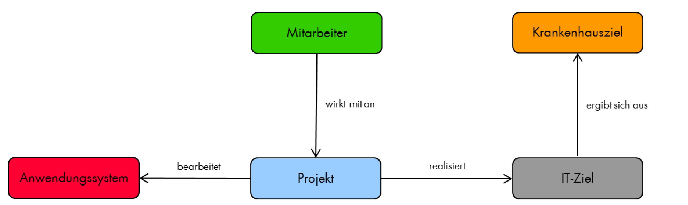

## Das Semantische Netz des Informationsmanagements im Krankenhaus (SNIK)

**Ziel des Forschungsprojekts ist ein theoretisch und empirisch begründetes, sowie erprobtes Semantisches Netz des Informationsmanagements im Krankenhaus (SNIK), das die Konzepte des Informationsmanagements beschreibt und verbindet.**

Das zu entwickelnde Semantische Netz soll auf den Methoden des Unified Medical Language System (UMLS) beruhen und zur weiteren Professionalisierung des Informationsmanagements (IM) im Krankenhaus beitragen.
Es verknüpft Begriffe des strategischen, operativen und taktischen IM, der Beschreibung von Informationssystemen und der Unternehmensstrategie und ordnet Methoden zu.
Auf Instanzebene nimmt es zudem eine empirisch begründete Auswahl und Priorisierung von Aufgaben des IM im Krankenhaus vor und stellt die Verbindung zu krankenhaustypischen Prozessen her.
Durch die Vernetzung der Begriffe der Ansätze für das IM und aktueller Rahmenwerke für das IM (z. B. COBIT und ITIL) schafft SNIK die Grundlage für krankenhausspezifische Anpassungen dieser Ansätze und Rahmenwerke.

Abbildung 1: Beispielhafter, denkbarer Ausschnitt aus SNIK

Die Abbildung 1 veranschaulicht beispielhaft einen denkbaren Ausschnitt aus dem geplanten SNIK.
Die IM-Konzepte Anwendungssystem, Krankenhausziel , IT-Ziel, Mitarbeiter und Projekt sind darin durch Relationen verknüpft.
Synonyme, Instanzen und explizite Verknüpfungen zu Ansätzen des IM sind jedoch nicht berücksichtigt.

SNIK soll in der Lehre und in der Praxis des Informationsmanagements im Krankenhaus erprobt werden.

## SNIK in der Lehre

**Auf der Basis von SNIK soll eine Unterrichtseinheit zum Informationsmanagement entwickelt, erprobt und ausgewertet werden.**

Diese Unterrichtseinheit, basierend auf einem eLearning-Modul, soll in das vorhandene Curriculum der internationalen Frank-vanSwieten-Lectures (FvSL) integriert, in allen an den FvSL beteiligten Universitäten eingesetzt und durch Befragung der Dozenten ausgewertet werden.

## SNIK in der Praxis des Informationsmanagements im Krankenhaus
**Auf der Basis von SNIK soll prototypisch die Software CIO-Navigator (CION) realisiert und erprobt werden, die dem CIO und der Krankenhausleitung die Navigation durch das vernetzte Informationsmanagement ermöglicht.**

Der Prototyp eines SNIK-basierten CIO-Navigators dient der Datenintegration der im IM und im Krankenhausmanagement genutzten Werkzeuge und soll die für das vernetzte IM notwendigen Informationen visualisieren.
Der CIO-Navigator kann als Business-Analyse-Werkzeug aufgefasst werden.
Für den CIO-Navigator soll zunächst ein Nutzungs- und Architekturkonzept entwickelt werden.
Dabei ist insbesondere der Umgang mit Änderungen in den Daten der integrierten Werkzeuge eine Herausforderung.
Die Tauglichkeit des CIO-Navigators und des Architekturkonzepts soll schließlich an zwei Krankenhäusern erprobt werden.

